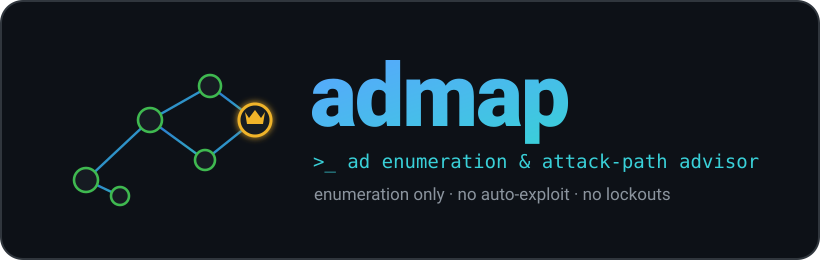

<p align="center">
  
</p>

AD enumeration orchestrator with an attack-path advisor, loosely following the
Orange Cyberdefense AD mindmap.

It runs enumeration tools, parses their output into a single engagement DB, and
tells you what to do next. It does not exploit anything - the advisor prints
copy-paste commands for you to run by hand. Password spraying and LLMNR/NBT-NS
poisoning are off by default because of lockout and noise.

## Layout

```
admap/
  core/            state, models, tool runner, config, logging
    models.py      dataclasses for the SQLite schema
    state.py       engagement DB (idempotent upserts)
    runner.py      subprocess wrapper + --dry-run + PATH checks
    config.py
    log.py
  advisor/
    rules.py       one rule per mindmap branch -> Recommendations
    advisor.py     runs the rules, ranks by severity
  modules/
    parsers.py     output parsers (netexec / kerbrute / impacket / certipy)
    discovery.py   port sweep, DC id, SMB signing
    unauth.py      null SMB, RID, LDAP anon, kerbrute, AS-REP
    authed.py      BloodHound, kerberoast, GPP, LAPS, share spider
    bloodhound.py  ingest collection .zip -> admin paths, delegation, DCSync
    adcs.py        certipy ESC enum
    delegation.py  findDelegation
  report.py        markdown + json report
  cli.py
  tests/           pytest suite (parsers, state, advisor, ingest)
```

## Usage

```bash
python -m admap init --targets 10.10.10.0/24 --domain corp.local --dc 10.10.10.10
python -m admap run discovery
python -m admap run unauth
python -m admap advise

# once you have a credential
python -m admap creds --user bob --password 'Passw0rd!'
python -m admap auto
python -m admap report
```

`--dry-run` on any command prints the tool invocations instead of running them.

## Docker (self-contained image)

The `Dockerfile` builds a "fat" image with admap and every tool it calls baked
in (nmap, NetExec, Impacket, kerbrute, ldapsearch, BloodHound.py, Certipy,
smbclient) so nothing else needs installing on the host. The image is
Debian-based and self-contained, so the host OS is irrelevant - it runs the same
on Ubuntu, Kali, or anywhere Docker runs.

```bash
# build once (~5-10 min; ~2.4 GB image - NetExec's dep tree is the bulk)
docker build -t admap .

# run against a target: --network host to reach the DC,
# -v "$PWD":/work so the DB, hashes and BloodHound zip land on the host
docker run --rm --network host -v "$PWD":/work -w /work admap \
    init --targets 10.10.10.0/24 --domain corp.local --dc 10.10.10.10
docker run --rm --network host -v "$PWD":/work -w /work admap run discovery
docker run --rm --network host -v "$PWD":/work -w /work admap run unauth
docker run --rm --network host -v "$PWD":/work -w /work admap advise
```

Handy alias so operators just type `admap ...`:

```bash
alias admap='docker run --rm --network host -v "$PWD":/work -w /work admap'
```

The build installs the Python tools in isolated pipx venvs (so NetExec and
Impacket don't clash on dependencies) and pulls a Rust toolchain, which NetExec
needs to build some wheels. Full tool list, source links, and build gotchas are
in [DOCKER.md](DOCKER.md).

## Adding a branch

Write a `_r_*` function in `advisor/rules.py` and add it to `ALL_RULES`. If you
need to collect the data first, add a wrapper in `modules/` and a parser in
`modules/parsers.py`.

## Requirements

Stdlib-only Python. It shells out to nmap, netexec, impacket, kerbrute,
ldapsearch, bloodhound-python and certipy (see `requirements.txt`). Missing
tools are skipped, not fatal.
